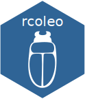

# Documentation du paquet `rcoleo` 

<!-- badges: start -->
[](https://github.com/ReseauBiodiversiteQuebec/rcoleo/actions)
<!-- badges: end -->

[](http://www.repostatus.org/#active)


`rcoleo` un paquet R permettant le retrait et l'analyse des données collectées dans le cadre du programme de suivi de la biodiversité (BdQc).

Ce paquet R expose les services `postgREST` de l'API de Coléo. Coléo est un système d'information sur la biodiversité du Québec développé par le laboratoire d'Écologie Intégrative de l'Université de Sherbrooke.

[Pour en savoir davantage...](https://coleo.biodiversite-quebec.ca/docs/)


## Installer le paquet `rcoleo`

```r
devtools::install_github("ReseauBiodiversiteQuebec/rcoleo")
```

## S'authentifier auprès de l'API

### Stratégie 1: Mise en cache

Il est **fortement recommandé** de mettre en cache votre jeton d'accès (jeton d'accès stocké dans un fichier `rds`) afin de s'assurer qu'il ne soit pas visible ou transmis avec votre code à un autre utilisateur. Ce jeton d'accès est unique et révocable. 

Pour cela, il vous suffit simplement d'enregistrer le jeton d'accès directement en tant que _Environment variable_

```r
file.edit("~/.Renviron")
```

cette linge va ouvrir un ficher text dans votre Rstudio. Rajoutez dans ce ficher un linge comme la suivante:


```r
RCOLEO_TOKEN=7f8df438e1be96a18436e9dab5d97d68ed0e0441d9b68f59e0ce631b2919f3aa
```

(utilizez votre propre token ici)

*Le jeton d'accès est un exemple ici et n'est aucunement valide.*
